# 一、项目介绍 [叶泽楷、林悦章、王俊涵]

## 背景

**自豪，2022年发布的国内大学排名商大又进一步；惊喜，商大学子某某某保研北大；恐怖，商大生活区疑似化粪池爆炸，到底发生了什么；求助，有没有浙小商可以帮忙代拿一下快递呀！**汇聚20000人的商大每天都有数不清的事情发生，或是学校大事，或是生活小事，处在同一校园的浙小商总有自己的疑惑、烦恼需要人解答，也总有处在吃瓜第一线的浙小商需要释放自己的分享欲。然而，目前为止，无论是商大微信公众号，还是借助朋友圈的某某商大营销号，都是中心化的交流平台，自由的表达和交流总有各自的不便。

本项目以uniapp为基础，打造一个浙商大师生交流平台，解决师生对校园等大事的社交欲望，拢合校园新闻，使用户可以足不出户的结实五湖四海的朋友，并且可以最快的参与朋友圈发生的故事。用户可以在浙商大师生交流平台添加自己的动态（新鲜事，日志，照片，分享），发表对好友动态的评论、赞、收藏等。

与其他社交平台相比，本平台旨在打造属于浙商大的师生交流平台，希望能为用户提供更为简洁，明了的界面展示和更为直接的交流方式。通过社交平台，师生可以充分利用网络资源，在闲暇之时简单有效的扩展人脉，与朋友互动交流。

## 项目需求分析

本项目旨在打造一个浙商大师生交流平台，解决师生对校园等大事的社交欲望，拢合校园新闻。根据需求将平台分为动态、消息中心、个人中心三个模块。


下面介绍模块功能。

- 动态模块：用户可以选择进行发表新鲜事、添加自己的动态（新鲜事，日志，照片，分享），发表对好友动态的评论、赞、收藏等，同时用户可以根据自己的需求，创建不同的收藏夹，对自己收藏的动态进行很好的分类。

- 消息模块：用户可以消息中心接收与自己相关的信息，其他用户对自己动态的评论、点赞。以及对自己的评论进行回复等消息。

- 个人模块：该模块实现了用户的基本操作，注册时用户可以填写自己的个人资料，上传头像完善自己的信息，可以对自己收藏，动态进行管理。

## 计划和分工

| 人员   | 负责工作                                                     | 贡献度 |
| ------ | ------------------------------------------------------------ | ------ |
| 王俊涵 | 前端：发布模块、个人中心模块、我的消息模块、我的收藏、分享模块 | 1/3    |
|        | 项目演示                                                     |        |
| 林悦章 | 前端：广场模块、评论模块、收藏动态                           | 1/3    |
|        | 后端：动态模块、评论模块 及 相关测试                         |        |
| 叶泽楷 | 后端：基础架构及配置，model 层文件，用户模块、收藏模块及 相关测试，部署 及 CI | 1/3    |
|        | 原型图设计                                                   |        |

# 二、界面原型设计 [叶泽楷]

## 2.1 用户相关

### 2.1.1 我的

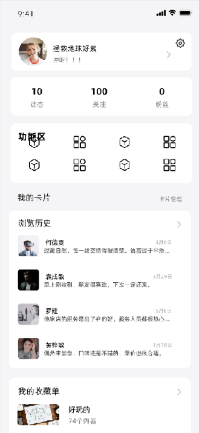

我的界面核心在于为用户提供个人的基本信息及便捷的使用体验。这里使用了模块化的设计，使得各部分的功能更加独立分明，让用户更容易获取到需要的信息及功能。

- 首先，最高一块用于显示用户头像、昵称及个人简介信息，通过齿轮的图标标识设置，向右的小箭头表明该栏可以通过点击进入个人中心界面。
- 下一块简单明了的标识了用户的动态数、关注数、粉丝数，这也是我们平台带给用户最核心的功能需求。
- 在下一块是功能区，放置一些提示性的标识，告诉用户图标所对应的功能，考虑进度原因，可能来不及故未详细设计。
- 最下方是“我的卡片”，该部分主要为用户提供常用功能的快捷操作，如浏览历史、收藏单等，仅显示最基本的内容，主要起到标识的作用，目的在于方便用户快速定位到相关界面，而不是获取到完整信息。

### 2.1.2 登录

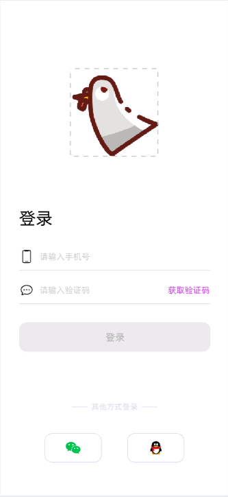

用户要想使用完全功能，则需要首先进行登录，若用户未登录，通过点击我的界面的头像处将跳转到登录界面。

- 这里的设计原本是为安卓APP设计的，后来考虑到用户对此类软件的使用偏好等，改用小程序来进行呈现。
- 对于小程序来说，我们直接摒弃了手机账号等登录方式，仅保留了微信授权登录，也即正上方为我们产品的logo，其下方为授权登录的按钮。

### 2.1.3 设置

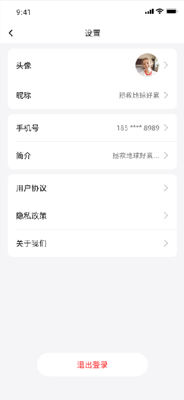

通过点击我的界面右上角的齿轮图标，将进入设置页面。

- 该界面继承了我的界面的设计风格，根据功能类型，对信息进行了划分。
- 上方的是用户个人信息相关模块，用户可在此对其进行快速修改。
- 下方设计了用户协议、关于我们等按钮，这部分仅表示我们有这个意识，但不做具体实现相关内容的打算。
- 最下方是“退出登录”按钮，用红字进行醒目标识，符合平时使用习惯，方便用户操作。

### 2.1.4 个人中心

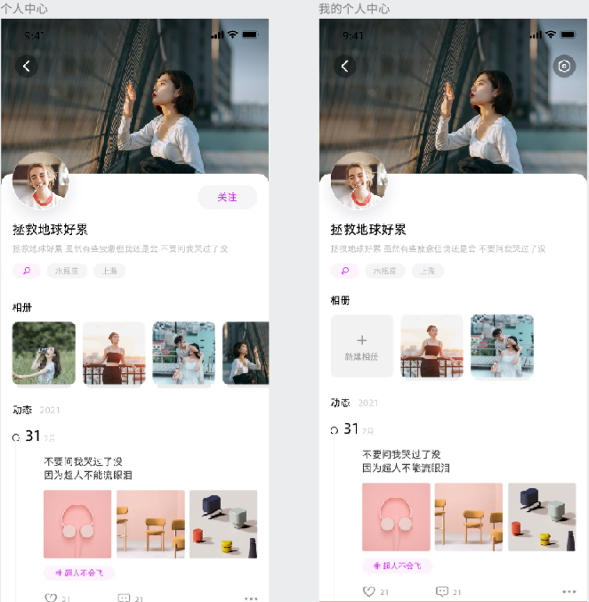

个人中心主要用于展示用户的基本信息及动态相关的内容，主体是动态。

- 首先，最上方是用户自定义的背景，在不显得单调的同时，更容易突出用户的特色，增加用户对产品的好感，也让其他用户多一维度了解他人。
- 下方是用户的头像、昵称、简介、性别等，头像为圆形，主要是因为与其后的白色分割背景形成差异，避免都是圆角矩形带来的审美疲劳。
- 下方则是相册和带时间线的动态显示。由于平台还处于摸索阶段，相册功能将暂不实现，重点在于动态。
- 动态以时间线的形式显示，一方面比较新颖，另一方面方便对用户发帖的情况一目了然，提高他人对该用户的了解程度，看起来也更有仪式感，设置可以当作日记来使用。
- 本用户的个人中心相较于他人，主要是对相册的编辑功能及右上角的 关注状态 按钮的显示。
- 当用户上划时，最好能实现用户信息的吸顶。

## 2.2 消息相关

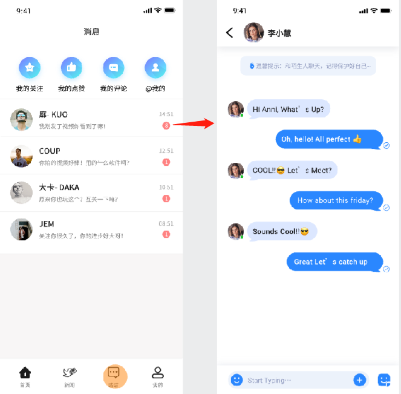

消息主要是用于聚合来着平台及其他用户对本用户的信息。

- 最上面分了四个图标，并辅以相应文字，代表“我的关注”、“我的点赞”、“我的评论”、“@我的”。
- “我的关注”主要是本用户关注的用户的相关活跃情况，如发帖等，这在后端实现上较为复杂，暂缓实现。
- “我的点赞”主要是本用户点赞的动态，通过该按钮可以快捷找到这些内容。
- “我的评论”主要是本用户的评论，通过该按钮可以快捷找到这些内容。
- “@我的”主要是用户通过“@ + 用户名”来达成功能，这在后端上较为复杂，暂缓实现。
- 下面是私信提示内容，左边的图为私信详情，由于这部分对实时性要求较高，独立实现难度较大，暂缓实现。

## 2.3动态相关

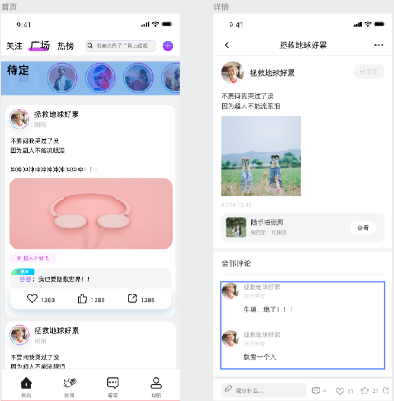

动态是我们平台的核心，用户打开鸽子广场后，首页即为用户发布的动态。

- 首先，最上方为 关注、广场、热榜 三栏标识，用户可以通过左右滑动实现切换，该实现在小程序上可能存在一定难度，可以退而求其次通过点击实现切换。
- 在右上方是搜索框和一个加号图样的发布动态按钮，搜索框中显示热搜内容，由于新闻页面的去除及消息页面的合并简化，发布按钮将下移到导航栏，更方便用户操作。
- 下方是模块化的用户动态，顶栏显示用户头像、昵称及发布时间；下方为 3 行左右的动态内容；再下方为显示不超过 9 张的图片显示，图片下方是动态附带的 tag；tag 下方为热评及点赞、收藏、分享功能栏，功能栏方便了用户为一些简短的动态直接操作，也可以为用户在最外层提供信息反馈。
- 右侧为动态详情，上方为动态完整的显示内容，用户可以在这里进行关注操作，下方为评论区，用户可通过点击用户回复信息进行评论，也可以直接在最下方的输入栏直接评论；最下面功能栏将吸附在底部，提供点赞、收藏、转发等便捷操作，并提供相应数值显示来展示动态的影响程度等。

## 2.4 新闻相关

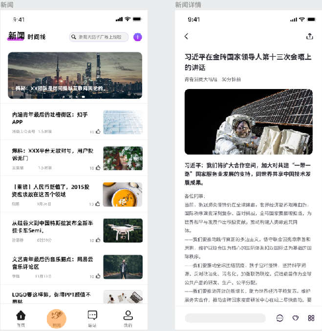

这部分设计的初衷本是对学校新闻的抓取投放，但考虑到我们是一个校园社区，这方面需求不大，故暂时放弃实现。

该界面也是较为常规的设计，主要新闻标题辅以新闻图片、发布者、时间等信息。

# 三、系统架构设计 [叶泽楷、林悦章、王俊涵]


##  3.1 系统设计

本项目借鉴了MVC思想，将交互过程分为Model（模型）、Template（模板）和View（视图），即MTV设计模式。

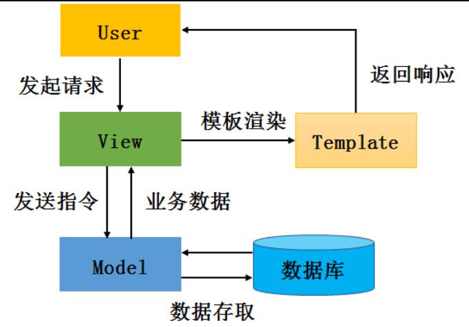

并采用前后端分离的设计模式，将 MTV 模式中 Template 分离为前端，前端和后端通过 RESTful 接口进行数据的交换。前端使用 uniapp，后端使用 Django。前后端可以身心愉快地专注于各自的领域，可以在一定程度上提高开发效率。


前后端都各自有自己的开发流程，构建工具，测试集合，关注点分离，前后端变得相对独立并解耦合。

|  后端   | 前端  |
|  ----  | ----  |
| 提供数据  | 接收数据，展示数据 |
| 处理业务逻辑  | 处理渲染逻辑 |

## 3.2 开发流程

- 后端编写和维护接口文档，在 API 变化时更新接口文档

- 后端根据接口文档进行接口开发

- 前端根据接口文档进行开发 + Mock平台

- 开发完成后联调和提交测试

## 3.3 规范原则

- 接口返回数据即显示：前端仅做渲染逻辑处理；

- 渲染逻辑禁止跨多个接口调用；

- 前端关注交互、渲染逻辑，尽量避免业务逻辑处理的出现；

- 请求响应传输数据格式：JSON，JSON数据尽量简单轻量，避免多级JSON的出现；
- 各请求情况需遵守如下形式：

    ```json
    // 请求成功：
    {
        "error": null,
        "data": null || "success msg" || "data object"
    }
    // 请求失败：
    {
        "error": "error" || "permission denied",
        "data": "error msg"
    }
    // 服务端错误:
    {
        "error": "server error",
        "data": "server error"
    }
    ```

## 3.4 前端设计

本项目前端采用 uniapp 开发微信小程序，将前端界面按照功能划分为动态，消息中心，个人中心三个模块。区分不同的模块可以使页面与页面，功能与功能间互不干扰。各模块下子功能与父模块有一定数据的关联性，方便于对父模块数据的继承。


以下结束各个模块的功能

- 动态模块：用户可以选择进行发表新鲜事、添加自己的动态（新鲜事，日志，照片，分享），发表对好友动态的评论、赞、收藏等，同时用户可以根据自己的需求，创建不同的收藏夹，对自己收藏的动态进行很好的分类。

- 消息模块：用户可以消息中心接收与自己相关的信息，其他用户对自己动态的评论、点赞。以及对自己的评论进行回复等消息。

- 个人模块：该模块实现了用户的基本操作，注册时用户可以填写自己的个人资料，上传头像完善自己的信息，可以对自己收藏，动态进行管理。

## 3.5 后端设计

本项目后端使用Django进行开发，Django 使用 ORM（Object Relational Mapping，对象关系映射）把对象与数据库中的表关联起来，对象的属性映射到表的各个字段，同时，还把对表的操作对应到对对象的操作，实现了对象到 SQL、SQL 到对象的过程转换。

 Django 把表模型定义为 Model，定义时需要继承自 django.db.models 中的 Model 类，Model 类中的每一个属性都能映射到表的对应字段。针对数据库中提供的字段类型，Django ORM 都有对应的 Filed 来表达。对于数据库表的增删改查操作，Django 也都提供了 API。

Django 视图是 MTV 设计模式中的 V，它在 Django 中的体现是一个 Python 函数或者类，接收 Web 请求并返回 Web 响应。

同时提供了用户模块与权限系统，能够快速实现与用户、用户组、权限相关的基本功能。Django 的用户模块定义在 auth 中，方便对前端用户登录，注册等进行管理。

我们将不同的 Model 按照功能进行划分，分为以下几个 app（以下 API 设计也是根据此APP 的划分）。划分不同 app 可以有利于我们对前端路由进行分类管理，对下面的API设计起到了至关重要的作用。


## 3.6 接口设计

我们对以上的后端划分的 app，根据 RESTful 架构将 API 接口分为以下几个类别，并使用apifox 进行集中测试。


我们使用 apifox 对 api 进行更新和维护，使得项目接口的新增和变更能同步到项目所有成员中，避免数据不同步和沟通不及时带来的麻烦；使得测试人员无须重建新项目或手动导入更新部分，减少了不必要的工作量。

同时它将多个软件集成为一体避免了数据在不同软件间多次导出导入的琐碎耗时以及可能存在的不兼容情况，大大提高了测试效率。

## 3.7 日志系统设计

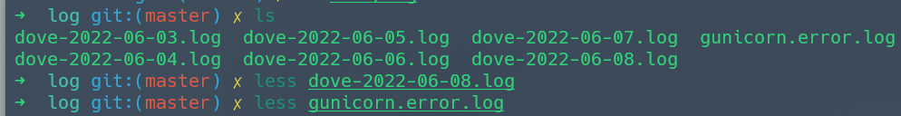

后端为了便于追踪排查项目上线后的问题，加入了日志系统：

- 对于本地调试，默认使用控制台输出系统错误。
- 对于线上环境，Django 将按照一定格式，收集  [INFO] 级别起的 logs，并按照日期，每日生成新的 log 文件。

日志输出格式类似如下：

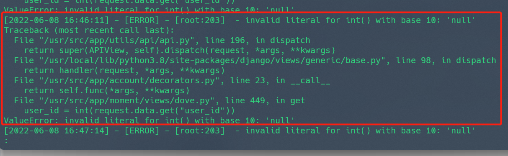

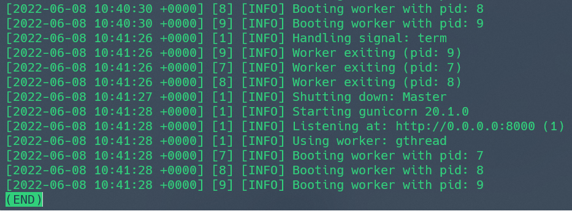

# 四、API设计 [叶泽楷、林悦章、王俊涵]

上面提到，我们对以上的后端划分的app，根据RESTful架构将API接口分为以下几个类别，并使用apifox进行集中测试。接下来对不同模块的API接口进行解释说明

- 数据接口：/api/v1/

- 静态文件：/public/


## 4.1 动态模块

动态模块包含用户发布动态、根据点赞数获取头条推荐、删除用户动态等多个接口，实现了用户对动态的点赞，评论等功能。

|  接口URL  | 请求方式  |  说明  |
|  ----  | ----  | ----  |
| /api/v1/moment | POST |用户发布动态|
| /api/v1/moment/recommendation |  GET |获取头条推荐 |
| /api/v1/moment/top | GET  |  获取热榜动态|
| /api/v1/moment/like | GET  |  给动态点赞/取消点赞 |
| /api/v1/moment/history |  GET |  获取用户浏览历史 |
| /api/v1/moment/search | GET  |通过关键字或直接获取动态 |
| /api/v1/moment/follow| GET  |  获取关注博主发布的动态 |
| /api/v1/moment/updatefollow |  GET |  更新用户互相关注状态 |
| /api/v1/moment/updatelike | GET  |  更新用户对动态的赞状态|
| /api/v1/moment/one|   |  根据id获取动态 |
| /api/v1/moment/uploadoneimage |  POST |   上传一张动态图片|
| /api/v1/moment/publish |  POST |用户发布动态（图片已上传）|
| /api/v1/moment/myall| GET  |  获得用户发布的所有动态 |
| /api/v1/moment/delete |  GET |  删除用户动态 |

## 4.2 用户模块

用户模块包含用户登录、登出等接口，实现获得用户信息，用户上传头像以及用户token认证等功能

| 接口URL                | 请求方式 | 说明              |
| ---------------------- | -------- | ----------------- |
| /api/v1/login/wechat   | POST     | 用户登入          |
| /api/v1/logout/wechat  | POST     | 用户登出          |
| /api/v1/user/profile   | GET      | 获取个人详细信息  |
| /api/v1/user/profile   | PUT      | 修改个人信息      |
| /api/v1/user           | GET      | 获取用户列表      |
| /api/v1/user/following | POST     | 关注用户          |
| /api/v1/user/following | DELETE   | 取关用户          |
| /api/v1/oauth/wechat/  | POST     | 微信用户token认证 |
| /api/v1/user/avatar    | POST     | 用户头像上传      |

## 4.3 评论模块

评论模块实现用户对评论的获取，点赞，删除等功能

| 接口URL                   | 请求方式 | 说明               |
| ------------------------- | -------- | ------------------ |
| /api/v1/comment           | GET      | 获取动态的所有评论 |
| /api/v1/comment/tomoment  | GET      | 对动态进行评论     |
| /api/v1/comment/tocomment | GET      | 对评论进行评论     |
| /api/v1/comment/like      | GET      | 对评论进行点赞     |
| /api/v1/comment/top       | GET      | 获取动态的神评论   |
| /api/v1/comment/mine      | GET      | 获取和我相关的评论 |
| /api/v1/comment/mylike    | GET      | 获取和我相关的点赞 |
| /api/v1/comment/delete    | GET      | 对评论进行删除     |

## 4.4 收藏单模块

收藏单模块保护用户对个人收藏单的获取，对收藏单的创建、删除等功能

| 接口URL                         | 请求方式 | 说明           |
| ------------------------------- | -------- | -------------- |
| /api/v1/star/moment/list/       | GET      | 获取个人收藏单 |
| /api/v1/star/moment/list/       | POST     | 创建收藏单     |
| /api/v1/star/moment/list/delete | GET      | 删除收藏单     |
| /api/v1/star/moment/list/       | PUT      | 修改收藏单     |
| /api/v1/star/moment/            | POST     | 收藏动态       |
| /api/v1/star/moment/delete      | GET      | 取消收藏动态   |

## 4.5 私信模块

私信模块包含用户获取所有与自己相关的信息，以及发送私信的功能

| 接口URL         | 请求方式 | 说明                     |
| --------------- | -------- | ------------------------ |
| /api/v1/message | GET      | 获取关于我的所有私信     |
| /api/v1/message | GET      | 获取与对方所有的私信内容 |
| /api/v1/message | POST     | 发送私信                 |
| /api/v1/message | POST     | 更新私信的未读状态       |

# 五、数据库设计 [林悦章、叶泽楷]

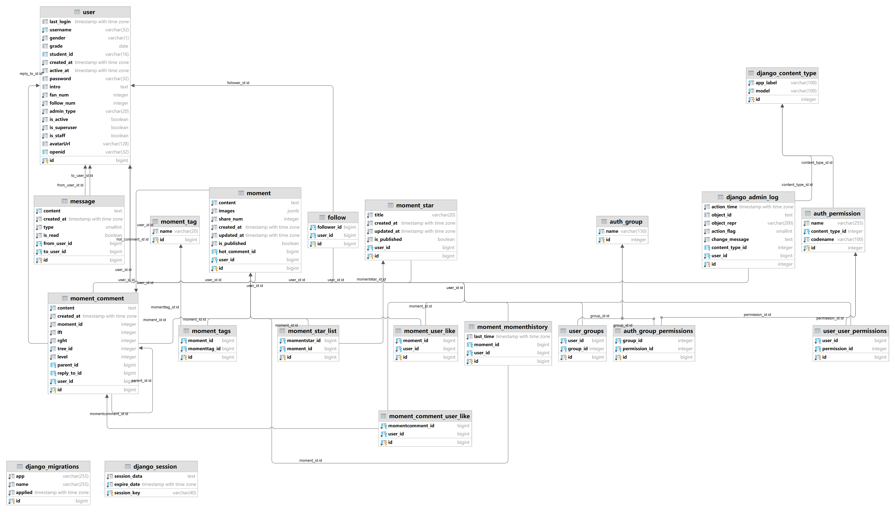

传统的数据库设计SQL语句重复利用率不高，越复杂的SQL语句条件越多，代码越长。会出现很多相近的SQL语句。很多SQL语句是在业务逻辑中拼出来的，如果有数据库需要更改，就要去修改这些逻辑，这会很容易漏掉对某些SQL语句的修改。写SQL时容易忽略web安全问题，给未来造成隐患。SQL注入。

本系统使用Django的ORM模型进行数据库的设计。PostgreSQL在全球是仅次于MySQL的开源免费的关系型数据库，功能更加强大，且通过查询官方文档可以发现，**Django对其有着最好的适配与支持**，是Django首选的关系型数据库。Django使用ORM（Object Relational Mapping，对象关系映射）把对象与数据库中的表关联起来，对象的属性映射到表的各个字段，同时，还把对表的操作对应到对对象的操作，实现了对象到SQL、SQL到对象的过程转换。以下为各个表的结构和说明。

## 用户 User

| 属性         | 类型     | 备注                                                         |
| ------------ | -------- | ------------------------------------------------------------ |
| id           | int      | 用户id（主键）                                               |
| grade        | datetime | 入学日期                                                     |
| gender       | char     | 用户性别                                                     |
| password     | char     | 保留，可空，用户登录密码                                     |
| username     | char     | 用户名                                                       |
| avatarUrl    | URL      | 用户头像URL                                                  |
| intro        | text     | 用户签名is                                                   |
| is_active    | boolean  | 用户是否可用                                                 |
| is_superuser | boolean  | 是否为超级用户                                               |
| is_staff     | boolean  | 是否为管理员                                                 |
| actived_at   | datetime | 最近活跃时间                                                 |
| fan_num      | int      | 粉丝数                                                       |
| follow_num   | int      | 关注数                                                       |
| created_at   | datetime | 注册时间                                                     |
| openid       | string   | 【微信小程序】用户唯一标识                                   |
| session_key  | string   | 【微信小程序】会话密钥                                       |
| unionid      | string   | 【微信小程序】用户在开放平台的唯一标识符，若当前小程序已绑定到微信开放平台帐号下会返回，详见 [UnionID 机制说明](https://developers.weixin.qq.com/miniprogram/dev/framework/open-ability/union-id.html)。 |

##  关注 Follow

| 属性      | 类型 | 备注                            |
| --------- | ---- | ------------------------------- |
| id        | int  | 主键（A关注B）                  |
| user_id   | int  | 用户B id(用户A关注的对象)(外键) |
| follow_id | int  | 用户A id（外键）                |

##  动态 Moment

| 属性         | 类型       | 备注                                           |
| ------------ | ---------- | ---------------------------------------------- |
| id           | int        | 动态id（主键）                                 |
| user_id      | int        | 用户id,发布动态的id(外键)                      |
| content      | richtext   | 发布动态的内容                                 |
| images       | json       | 动态附带的图片【暂时打算直接存url json】       |
| user_like    | ManyToMany | 点赞该动态的用户列表（会自动生成一个多对多表） |
| share_num    | int        | 分享数                                         |
| hot_comment  | int        | 热评id（外键）                                 |
| created_at   | datetime   | 创建时间                                       |
| updated_at   | datetime   | 最近编辑时间                                   |
| is_published | boolean    | 是否公开                                       |

##  点赞动态记录表 LikeMomentTime（记录用户点赞动态时间）

| 属性      | 类型     | 备注             |
| --------- | -------- | ---------------- |
| id        | int      | 点赞记录id(主键) |
| moment_id | int      | 动态id(外键)     |
| user_id   | int      | 用户id(外键)     |
| update_at | datetime | 用户点赞时间     |

##  用户浏览动态记录 MomentHistory

| 属性      | 类型     | 备注             |
| --------- | -------- | ---------------- |
| id        | int      | 浏览记录id(主键) |
| user_id   | int      | 用户id（外键）   |
| moment_id | int      | 动态id(外键)     |
| last_time | datetime | 最近浏览时间     |

##  评论 MomentComment

| 属性       | 类型       | 备注                                       |
| ---------- | ---------- | ------------------------------------------ |
| id         | int        | 评论记录id(主键)                           |
| moment_id  | int        | 被评论的动态id（外键）                     |
| reply_to   | int        | 回复用户的id                               |
| user_id    | int        | 评论的用户id(外键)                         |
| parent_id  | Tree       | 树结构，上级评论id(外键)，父节点等信息     |
| created_at | datetime   | 创建时间                                   |
| content    | richtext   | 评论的内容                                 |
| user_like  | ManyToMany | 点赞该评论的用户（会自动生成一个多对多表） |

##  点赞评论记录表 LikeMomentCommentTime（记录用户点赞评论时间）

| 属性      | 类型     | 备注             |
| --------- | -------- | ---------------- |
| id        | int      | 点赞记录id(主键) |
| moment_id | int      | 动态id(外键)     |
| user_id   | int      | 用户id(外键)     |
| update_at | datetime | 用户点赞时间     |

##  消息 Message

| 属性         | 类型     | 备注                    |
| ------------ | -------- | ----------------------- |
| id           | int      | 消息id（主键）          |
| from_user_id | int      | 发送者A的id(外键)       |
| to_user_id   | int      | 接收者B的id(外键)       |
| content      | RichText | 发送信息内容            |
| created_at   | datetime | 发送时间                |
| type         | SmallInt | 文字/图片/视频【0/1/2】 |
| is_read      | Boolean  | 是否已读                |

##  标签 Moment Tag

| 属性      | 类型 | 备注         |
| --------- | ---- | ------------ |
| id        | int  | 标签id(主键) |
| name      | char | 标签名字     |
| use_num   | int  | 使用次数     |
| moment_id | int  | 动态id(外键) |

##  **收藏单 Moment Star**

| 属性       | 类型       | 备注                                         |
| ---------- | ---------- | -------------------------------------------- |
| id         | int        | 收藏条目id(主键)                             |
| user_id    | int        | 收藏者id(外键)                               |
| moment     | ManyToMany | 收藏动态id列表(外键，会自动生成一个多对多表) |
| title      | char       | 收藏单名字，同一用户收藏单名不可相同         |
| created_at | datetime   | 创建时间                                     |
| update_at  | datetime   | 修改时间                                     |
| is_publish | boolean    | 是否公开                                     |

# 六、微信小程序端的实现 [王俊涵、林悦章、叶泽楷]

## 6.1 用户管理的实现 [叶泽楷、王俊涵]

### 6.1.1 用户态维持逻辑设计

对于小程序端用户登入态维护，后端设计有 `oauth` 、 `login` 和 `logout` 接口分别用于`用户登录验证及保活` 、 `用户登入或登录` 和 `用户退出`。

- 对于初次使用的用户，点击登录按钮后，通过请求 `login` 接口判断用户不存在，跳转注册界面进行注册。
  - 特别地，适配了微信小程序最新的用户信息保护政策，实现微信用户头像及昵称的获取。
- 对于登录用户，小程序将 `token` 缓存到本地，当再次打开小程序时，小程序将会自动携带 `token` 请求 `oauth` 接口：
  - 若 `token` 未过期，验证用户处于登录状态，更新用户 `token`，实现用户静默登录。
  - 若 `token` 过期，用户登录态验证失败，小程序不会做额外提醒，当用户点击登录按钮后，小程序携带用户 `code` 请求 `login` 接口实现登录。
- 用户点击退出按钮后，小程序请求 `logout` 接口，并抹除小程序本地一切用户信息。

上述逻辑在最大程度上避免了对用户的打扰，同时也保证了较好的安全性，经常登录的用户无需手动登录、在注册时提供用户微信头像及昵称选择等，也满足了用户的使用体验。

### 6.1.2 无感知自动验证登录的页面实现

小程序页面采用了一套**无感知自动登录**的逻辑体系。

- 对于**未注册用户**，整个过程中，只有注册过程需要手动填写。
- 对于**已注册用户**，哪怕已因长时间未使用导致token过期，在整个使用过程中也不再需要手动登录，也不需要关心自己账号的登录与否。

具体实现的方式如下：

1. 我们重写了UniApp自带的底部导航栏Tabbar，**自主封装**了一个新的基于U-tabbar的底部导航栏组件/components/tabbar.vue，如下图所示。
2. 在新的组件中，我们重写@change事件，以**拦截每次切换底部导航的请求**，实现了在点击“我的”与“发布”这两个需要登录鉴权的模块时，自动鉴权，只有鉴权通过，才能跳转到对应页面。

- 对于已登录用户，将调取全局变量中的token，检验token过期与否，无效则调用登录请求，有效则通过鉴权。
- 对于未登录用户，直接请求登录，并存储token至全局变量。
- 对于未注册用户，跳转注册页面。
- 特别的，我们使用了微信小程序的最新规范接口，请求登录时不再会弹出微信授权窗口，而是自动授权，实现了全程无感知。


##  6.2 首页动态实现 [林悦章、王俊涵]

根据功能模块将首页分为关注、广场、热榜三个子页面，并在首页添加搜索栏，以便于对自己感兴趣的动态进行搜索（搜索的依据可以是用户名，动态标题等信息），同时用于对动态的点赞、收藏，关注用户等功能。

### 6.2.1  关注、广场、热榜页面实现 [林悦章]

根据用户对分页器**uni-segmented-control**的选择，加载不同页面到**view**，每个页面有独立的加载函数，调用单独的后端接口，后端接口返回动态列表，前端页面通过**v-for**将其全部显示出来。同时给分页器设置监听器，一旦用户回到这个页面或者，加载其他相关页面，会调用相关的函数。顶部的分页器具有吸顶的效果，给用户良好的体验。用户可以随时切换想看的内容


- 对于关注页面，显示的是用户所关注的用户发布的所有动态，后端接口**/moment/follow**返回动态列表安装发布时间降序排列。

- 对于广场页面，显示的是所有用户发布的所有动态，调用后端接口**/moment/recommendation**的同时需要传入参数limit来限定一次加载动态的条目

- 对于热榜页面，显示的是热度最多的动态（也就是点赞数最多的），同样调用后端接口**/moment/top**的同时需要传入参数limit来限定一次加载动态的条目，并且将返回结果按照点赞数降序排列

对于某条动态，用户点击发布者头像或者用户名会跳转到该发布者的动态中心页面。


### 6.2.2 点赞动态、关注用户逻辑设计 [林悦章]

用户通过点击按钮图标来实现对动态的点赞，关注用户的功能，页面通过**v-if**来条件加载点赞与点赞后，关注与已关注的图标，其判断的依据是用户对动态是否点赞（**boolean值**），对用户是否关注（**boolean值**），用户点击相应的按钮图标，会调用相应接口**/moment/like、/moment/updatefollow**来更新数据，并且修改**boolean值**，之后页面重新加载部分组件。如果当前用户与动态发布者是同一用户的时候，则通过**v-if**条件渲染不显示关注图标。


### 6.2.3 收藏动态逻辑设计 [林悦章]

用户点击收藏按钮想对喜爱的动态收藏的时候，页面会加载 **uni-popup** 弹窗，并且调用后端接口 **/star/moment/list/** 获得个人收藏单，用户可以选择想要的收藏单进行收藏动态，当然用户也可以选择对收藏单进行添加、删除的操作。添加收藏单的时候会加载另一个 **uni-popup **弹窗，要求用户输入收藏单的名字（该收藏单名字不能和已有的收藏单名字重复），点击确认就可以创建收藏单，并且调用后端/接口 **/star/moment/list/** 对收藏单数据进行更新，同时重新加载收藏单列表，调用回调函数对刚才的收藏单列表进行重新加载（为了防止消息的延迟，方法中设置 **setTimeout** 进行缓冲条的加载），删除收藏单为类似的逻辑。

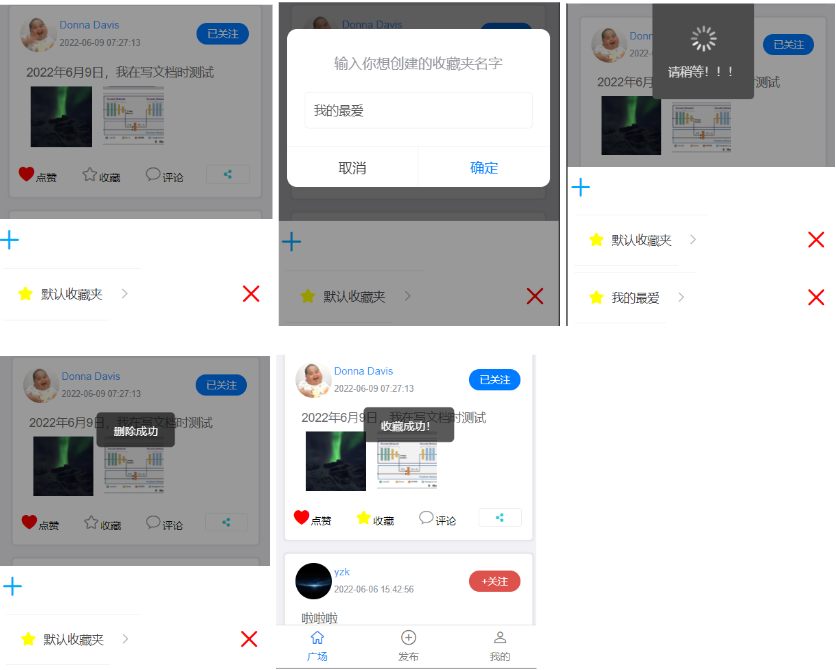

### 6.2.4 搜索动态逻辑设计 [林悦章]

搜索框设计采用 **uniapp** 组件 **uni-search-bar**，并重写了其组件的逻辑处理方法，用户在搜索款想输入的内容，函数会把 **keyword **传入给后端，并调用后端方法 **/moment/search** 对动态标题，发布者用户名等属性进行搜索，并将返回结果按时间进行排序，重新加载 **view** 组件。同时前端会提示用户输入不合法的错误（输入值为空等）。


### 6.2.5 动态分享微信的逻辑设计 [王俊涵]

本部分实现了小程序中动态的分享，用户在广场上浏览到喜欢的动态时，点击分享按钮可以直接分享至微信对话框中，而对方点击后可以直接进入动态详情界面查看。本部分难点在于，对于广场中的无数条动态，如何实现每条动态避免繁琐的重复代码实现分享，**如何实现每条动态分享后的预览图与标题都不同**。

具体思路如下：

1. 在动态卡片中，增加分享按钮，重写了分享按钮的Open-type属性为share，赋予微信开放能力。同时通过 **:dataName="item.moment_id"** ，将动态id传入。
2. 在广场页面重写 onShareAppMessage(res) 接口，根据传入的动态id自定义微信分享卡片的标题与跳转路径。


##  6.3 动态详情实现 [林悦章]

根据有上个页面传入的参数 **moment_id** 通过 **getMoment()** 和 **getComment()** 方法调用后端接口 **/moment/one** 和 **/comment** 获取该页面的动态详情和评论区信息，前端页面通过 **v-for** 将其全部显示出来。同时给该页面设置监听器，一旦用户回到这个页面或者，加载其他相关页面，会调用相关的函数重新加载数据。同时用于对动态的点赞、收藏，关注用户等功能。

### 6.3.1 点赞动态、关注用户逻辑设计

动态详情页面的点赞、关注功能采用与首页动态类似逻辑，用户通过点击按钮图标来实现对动态的点赞，关注用户的功能，页面通过**v-if**来条件加载点赞与点赞后，关注与已关注的图标，其判断的依据是用户对动态是否点赞（**boolean值**），对用户是否关注（**boolean值**），用户点击相应的按钮图标，会调用相应接口 **/moment/like、/moment/updatefollow** 来更新数据，并且修改 **boolean值**，之后页面重新加载部分组件。如果当前用户与动态发布者是同一用户的时候，则通过**v-if**条件渲染不显示关注图标。


### 6.3.2 收藏动态逻辑设计

动态详情页面的收藏动态逻辑设计与首页动态类似，用户点击收藏按钮想对喜爱的动态收藏的时候，页面会加载**uni-popup**弹窗，并且调用后端接口**/star/moment/list/**获得个人收藏单，用户可以选择想要的收藏单进行收藏动态，当然用户也可以选择对收藏单进行添加、删除的操作。添加收藏单的时候会加载另一个**uni-popup**弹窗，要求用户输入收藏单的名字（该收藏单名字不能和已有的收藏单名字重复），点击确认就可以创建收藏单，并且调用后端/接口**/star/moment/list/**对收藏单数据进行更新，同时重新加载收藏单列表，调用回调函数对刚才的收藏单列表进行重新加载（为了防止消息的延迟，方法中设置**setTimeout**进行缓冲条的加载），删除收藏单为类似的逻辑。页面效果见上面动态列表页面。

### 6.3.3 评论区逻辑设计

本项目动态下的评论区引用了第三方插件 **hb-comment** 的样式，并重写了相关布局和方法（如生成评论数结构的方法，删除评论，点赞评论，评论等方法）。进入页面，函数**getComment()** 调用后端接口 **/comment **获得该动态下的所有评论，所有评论条目都有父节点，如果某条评论归属于动态，则父节点为**null**。之后调用 **getTree()** 函数，该函数传入评论的条目信息，依照每条评论父节点的信息，构建树的结构。最后 **hb-comment** 组件依照构建出来的评论树，进行展示评论信息。

- 评论区上方显示评论的浏览数。

- 当该动态下没有评论的时候，显示目前没有评论，点击“抢沙发”就可以评论当前动态，页面会调用后端接口**/comment/tomoment**评论的条目进行更新，并通过回调函数，实时渲染页面。

- 当该动态下有评论时，**hb-comment**组件依照构建出来的评论树，展示嵌套的评论结构，用户可在任意一条评论下评论或者点赞，页面会调用回调函数实时刷新评论区。

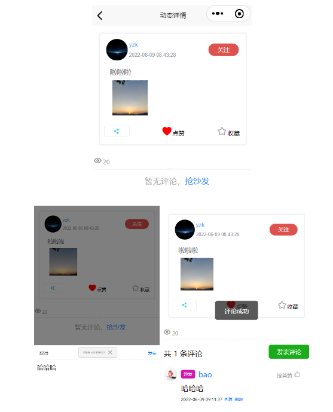

- 点赞某条评论的时候，页面会通过 **like()** 方法调用后端接口 **/comment/like** 对评论的点赞数据进行更新，并通过回调函数，实时渲染页面。


- 评论某条评论的时候，页面会通过**add()**方法调用后端接口**/comment/tocomment**对评论的条目进行更新，并通过回调函数，实时渲染页面。


- 删除评论的时候，页面会通过**del()**方法调用后端接口**/comment/delete**对评论的条目进行更新，并通过回调函数，实时渲染页面。

## 6.4 动态发布模块实现 [王俊涵]

动态发布模块一共含有两大功能：

- **图文动态**的发布，包括文字的字数统计与图片的选择上传
- **富文本动态**的发布，包括富文本界面的解析，富文本工具栏的实现。
- 普通动态与富文本动态标签页切换的布局

### 6.4.1 图文动态的发布

图文动态需要保证用户在发布时不会发布字数过多的图文，也要保证用户在键入过多换行时组件不会无限向下滚动，保证用户体验，此外还需需要保证用户在发布时的可以选择不超过九张图片进行依次上传。动态发布后将会自动根据返回接口的动态id，跳转至动态详情界面。

在实现上，我们通过文本域组件textarea，通过V-Model将文本内容与textValue属性双向绑定，实现了textValue的监听与字数限制。通过css布局中的maxlength设置最大行高为200。

图片的选择与上传上，与传统app不同，我们选择的是图片先上传，再发布动态的方式，也就是说，用户通过uniapp.chooseImgae选择本地图片后，就直接上传图片至服务器，此时用户还未发布动态，但图片地址已保存至imageList中，待编辑完文字点击发布后，文字与图片地址相关联。


我们基于 tui-upload 布局，重写了组件内部的图片上传方法 uploadImage 为我们自己的上传方法，实现了图片的**多选连续上传**，并获取图片地址。上传失败的图片将提示重新上传，同时上传后的图片调用 delImage() 函数进行删除，上传的图片格式包括 jpg/png/gif 等常见格式。

### 6.4.2 富文本动态的发布

富文本动态的编辑是我们为有长文撰写需求的文字工作者设计的，我们提供了**与腾讯文档一摸一样的富文本排版工具栏与编辑时的沉浸模式。**

- 富文本动态的编辑我们改造了cu-editor组件，单独将cu-editor中的工具栏剥离出来，**实现了对文本内容的排版功能，包括文字标号、行距改变、一二级标题的设置、文字颜色的设置、图片的上传与排版**。
- 重写了cu-editor组件中图片上传的方法，同样实现了图片的多选连续上传至我们服务器后端再发布。同时更改cu-editor中向外传递出的属性，使得cu-editor中工具栏的点击事件可以被监听，实现了点击工具栏时文本内容包括html标签，可以被正确的保存与上传。
- 此外我们还设置了**富文本编辑界面的沉浸模式**，我们监听了文本框内的焦点事件，当焦点在编辑框中时，悬浮发布按钮与底部导航栏将基于CSS的样式实现隐藏而避免了再次显示时的重新渲染，节省资源。只有点击工具栏中的完成后，发布按钮与导航栏才会显示。


### 6.4.3 动态标签页切换的布局

用户在发布界面可以通过选择顶部的标签页自由选择图文动态和富文本动态两个View的切换，此外还有滑动的动画切换效果。

采用了u-sticky组件包裹u-tabs标签页组件，实现了顶部标签页组的吸附，可以时刻置顶。再将current的V-model与本地current属性绑定，设置监听。利用V-show命令实现动态的标签页显示与隐藏。


## 6.5 个人中心模块的实现 [王俊涵]

### 6.5.1 “我的”界面实现

”我的“界面中主要包括**四块布局，头像卡片，我的基本信息，横排按钮与收藏列表预览**。难点在于布局的美观与重写click命令后的页面跳转以及将http请求的内容利用v-for命令迅速生成多个cell实现动态列表。

主要采用tui-card实现我的头像卡片与基本信息和横排按钮的显示，分别将布局放置于v-slot:body和v-slot:footer中。

收藏列表预览主要采用tui-list-view组件与tui-list-cell，搭配v-for命令，将http发出请求的列表填入。


### 6.5.2 个人动态卡片页面

个人动态卡片界面主要有我的资料卡片与支持富文本的复杂的动态列表组成。难点在于美观与动态显示。本界面不仅用于显示登入用户的卡片，也可以显示他人用户的个人动态界面。因此需要根据页面跳转传入的参数，**动态决定显示内容**。

#### 6.5.2.1 资料卡模块

资料卡模块不仅用于显示登入用户的卡片，也可以显示他人用户的个人动态卡片，资料卡片较为美观。本模块我们自己封装了一个组件head-portrait-card，方便复用。

当显示为本人时，将显示编辑资料按钮供跳转，当显示他人用户时，将显示两人的关注按钮以表示关注关系，拥有三种状态，互相关注，未关注，已关注，三种状态图标不同。

实现方法为在 onload 阶段，根据路由跳转传入的参数 user_id 与本地 token 比对，在利用 v-if-else 决定显示内容。


#### 6.5.2.2 动态列表模块

该页的动态卡片与首页的动态设计不同。

本页的难点在于富文本的解析与组合视图的拼接，**需要将用户头像栏、动态内容栏、底部按钮栏拼接而成，并且，还将显示点赞数量、收藏数量，实时更新，还需注意美观，调整过程较为繁琐**。需要根据访问页面是否为用户本人，**动态显示删除按钮。**


在该页中，可以通过**点击点赞、收藏、分享、删除等按钮**，分别进行点赞与取消点赞，收藏与取消收藏，分享至微信列表等操作。主要通过接口 “/moment/updatelike“、”/star/moment/“ 调用 Opentype=share 等方法实现。

并且点赞、收藏、评论后，将会实时更新点赞收藏的数量，主要方法为在接口调用返回的数据中将点赞数量、收藏数量数据覆盖本地的数据。

此处在删除动态后，需要**实时更新列表**，我们在实现过程中遇到较为麻烦的 bug，因为小程序没有刷新这一概念，如果需要实时更新若采用路由跳转，将会在返回堆栈上增加一层，也即采用路由跳转的方法实时更新需要返回两此才能退出界面，颇为丑陋。后来我们曲线救国，在同一界面采用重复请求用 **forceupdate 的方法实现了组件的局部刷新。**

### 6.5.3 编辑资料页面

该页面用户可以编辑自己的资料，并采用post请求更新自己的资料，更新后跳转至个人资料卡，采用u-cell-group 与u-cell组件实现。


实现方式主要为通过 /user/profile 接口 get 获取个人信息，再通过 put 同一接口更新。

### 6.5.4 我的粉丝和我的关注

用户在我的粉丝界面可以查看自己的粉丝列表，**拥有两种关系，快回关吧以及互相关注**，界面美观，符合直觉。点击列表可以跳转至用户卡片，点击按钮可以关注或者取消关注。难点在于视图的组合与美观，以及怎么停止点击事件的穿透。


采用 @click.native.stop 实现点击实现的截留。**采用 tui-list-cell 加上视图的 css 调整用 flex 属性实现头像、文本段与按钮美观的横向组合。**

我的关注与我的粉丝类似，不再赘述。

### 6.5.5 我的收藏

在我的收藏界面中，用户可以查看自己已收藏的动态，并且对动态进行点赞、收藏、分享。难点在于**页面的实时刷新与分享。**

分享的难点已在 6.2.5 节中详细阐述，在此不赘述。点赞、收藏的实现流程在 6.5.2.2 节中详细阐述，此处也不赘述。


## 6.6 消息中心 [王俊涵]

在”我的消息“页面中，共有5种情况：

- 用户可以查看来自动态和评论的回复列表
- 用户可以查看他收到的点赞
- 用户可以查看新关注他的人
- 用户可以单独查看在他动态下的回复
- 用户可以单独查看他人对他评论的回复

### 6.6.1 回复列表

本页由两部分组成，上方四个选项卡与下方的回复列表。用户在本页中可以方便按时间递减顺序方便的看到回复的集成。并且可以看到有红点提示，哪条消息是未读状态，方便用户点击。

同时回复列表中，也分消息的种类，一种是他人对本人评论的回复，一种是他人对我点赞的回复。


本页的回复列表，主要采用自我组装 item-box 类来构成，利用 flex 横向布局，从左到右依次是头像、文本段、时间与未读段。通过对接口 /comment/mine 的请求，将消息压入列表中。用 v-if-else 来区分 type 种类是评论消息还是动态消息。

### 6.6.2 查看来自评论的回复

本页中，可以单独查看来自评论的回复。通过对tui-card卡片的嵌套，采用v-slot方法区分了页中body与页footer，三明治结构。head层为回复我的用户的用户名与头像，body层为对本人评论的回复内容，footer层为我的原评论内容。实现了内层为本人发表的评论，外层为某用户对本人的回复。


### 6.6.3 查看来自动态的回复

本页中，可以单独查看他人对用户发布的动态的回复。实现原理与图片与上节类似，不再赘述。

### 6.6.4 查看新关注他的人

本页中，可以查看有谁新关注了我，通过对自我组装item-box类来实现，利用flex横向布局，从左到右依次是头像、文本段、时间与未读段。

值得一提的是，在本页中，未读的消息将被标绿色，提醒用户点击，点击后将通过navigate 跳转至用户页。


### 6.6.5 查看他收到的点赞

本页用户可以查看谁赞的他的动态并点击获得跳转。考虑到点赞数量远远高于评论数量，在本页中我们修改了 tui-card 组件的 css 布局，限制了他的 max-height 与 overflow 属性，将动态内容缩小至一行，使得点赞消息尽可能多的显示。


# 七、广场后端的实现 [叶泽楷、林悦章]

后端主要划分为了 5 大模块：用户 `account` , 动态 `moment`, 评论 `comment` , 收藏 `star` , 消息 `message` ，其中还包括了一个工具类模块 `utils` 和 一个 部署模块 `deploy`。

每个模块大致文件分配如下：

- `migrations`: 文件夹，其中文件由 `Django` 自动维护，用户数据库迁移
- `urls`: 文件夹，包含每个 `app` 的 `url` 配置，分 `dove.py` 和 `admin.py` 文件
- `views`: 文件夹，包含每个 `app` 的视图函数，业务逻辑主要在此实现，分 `dove.py` 和 `admin.py` 文件
- `__init__.py`: `python` 包标识文件
- `admin.py`: 后台管理站点实现文件，借助 `Django` 自带的后台站点 `admin` 模块实现
- `apps.py`: `Django app` 标识文件
- `decorators.py`: 装饰器文件，其中主要封装了当前 `app` 提供的全局常用的装饰器
- `models.py`: 模型文件，其中定义了所有该 `app` 的 `models`，也即数据库表的 `ORM` 表示
- `serializers.py`: 序列化文件，包含本 `app` 的所有 `DRF` 序列化类
- `tests.py`: 测试文件，包含本 `app` 的所有测试用例

## 7.1 用户管理

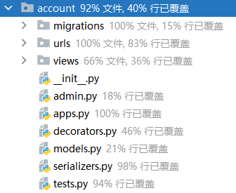

该模块负责用户的信息维护、登录态能力、数据后台管理等，对于小程序平台，摒弃了 `Django` 繁重的 `session` 机制，自己实现了一套基于 `token` 的用户验证机制。即，目前后端支持两套用户认证机制，一套基于自带的 `session` 实现的后台管理，一台基于自定义 `token` 实现的小程序用户管理。

其中，后台管理登录界面如下：

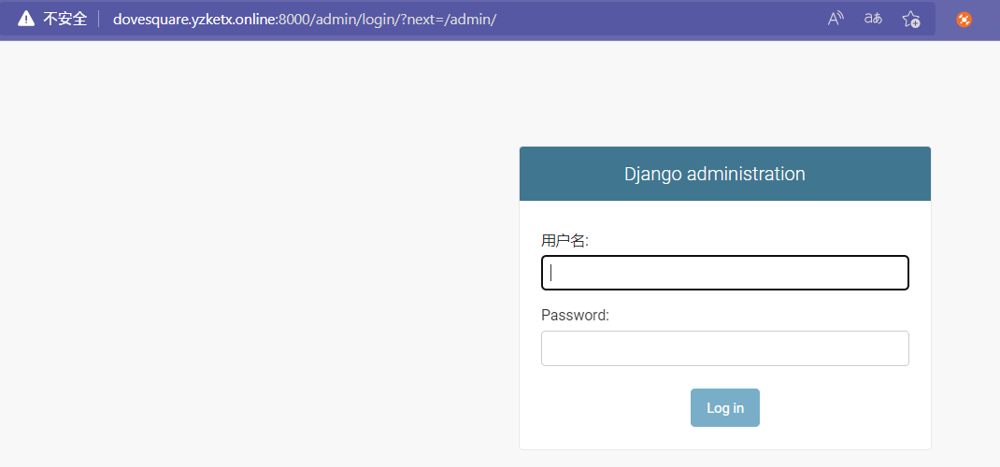

在用户验证及登入态上，`Django` 主要由 `auth` 模块及相关中间件控制，我们需要改写其配置及相关文件实现。

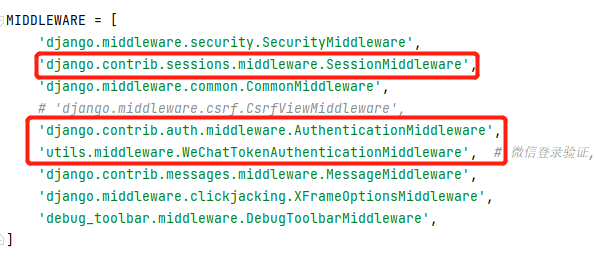

- 首先，`Django` 的登录认证需要经过 `django.contrib.auth.middleware.AuthenticationMiddleware` 中间件的处理，该中间件与 `session` 中间件强关联，需位于其后位置，用于后台站点的认证。
- 其后，是 `utils.middleware.WeChatTokenAuthenticationMiddleware` 自定义微信 `token` 认证中间件。`Django` 的接受到的数据流是根据你的中间件书写顺序来处理的，也即自带认证失败后，才会经过自定义 `token` 中间件的处理，这里是为了兼容后台站点而设置的。
- 该自定义中间件的主要目的在于验证微信用户及实现 `request.user`，而该处的 `request.user` 则需要通过重写 `auth` 模块的相关方法实现，由于该部分文件位于工具类模块，故单独详细说明。

## 7.1.1 微信用户定义

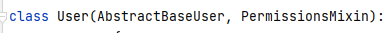

Django 自带有完善的用户 model 及权限划分，我们可以通过继承来实现，但其标准的用户 model 相对于我们的需求来说过于臃肿，很多字段是不必要的，因此，我们直接通过继承其抽象基类 `AbstractBaseUser` 来实现我们的 model，又由于其认证机制与其标准用户模型强关联，为了兼顾后台站点的实现，故沿用了 `is_superuser` 和 `is_staff` 字段来表示超级管理员与普通用户。

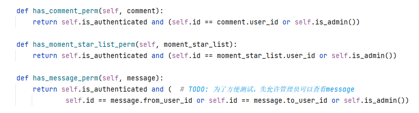

同时，我们也通过混入的形式，引入了 `PermissionsMixin` 类来配合实现细化的权限管理。

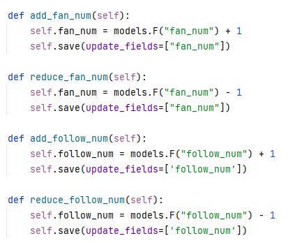

对于粉丝数、关注数等变化较为灵活的数据，最好的方法是先存入 `redis` ，然后再定时写入数据库，同时，为了防止在大量请求时造成写入冲突，使用了 `F` 语句，直接调用数据库方法进行处理，确保事务性。

## 7.1.2 自定义的 Token 认证机制

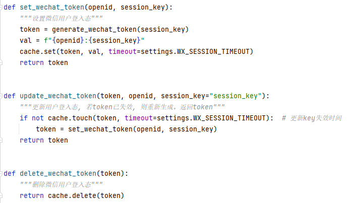

- `token` 使用小程序的 `app_id` + 本次用户的 `session_key` 拼接后，使用 `sha1` 加密算法转十六进制后生成
  - 常用的加密的算法一般有 `md5、sha1、sha256` 等，选用 `sha1` 是因为相对 `md5` 安全而比 `sha256` 要高效
- 以 `token` 为 `key` ，用户的 `openid+session_key` 为 `value` 存入 `redis` 数据库，并设置了单次过期时间为 5 天。
- `oauth` 和 `login` 接口都将会返回用户的有效 `token`
- 用户在每次请求时，需要携带 `token` 作为身份标识，后端以此为依据来维护用户登录态
- 若 `token` 可以从 `redis` 中查找到，并能通过 `session_key` 验证，则用户登录有效，反之则失败，需重新携带 `code` 请求 `login` 接口获取有效 `token`

## 7.1.3 用户装饰器的实现

由于用户登录态的判定是整个系统的基本要求，故将几个常用需求，如登录判断、用户角色判断、用户活跃时间更新等进行了封装。

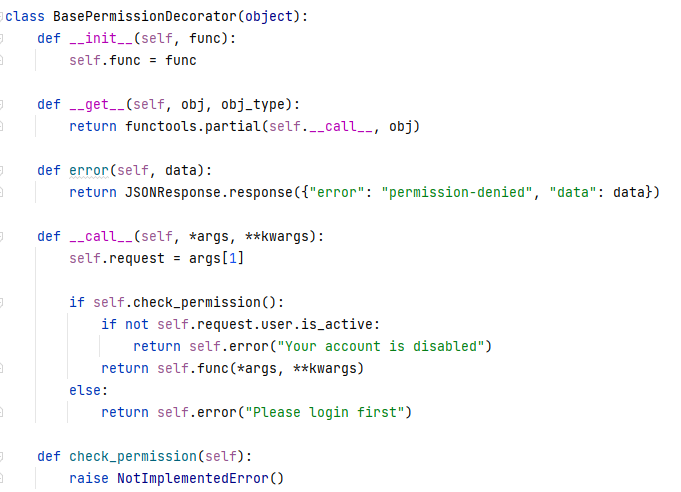

- 首先，定义了一个抽象类，该类提供了一个 `check_permission` 方法要求子类实现。`__call__` 方法表示该类是可调用的，当以装饰器的形式运行到该类时，`__call__` 方法将被调用，通过子类实现的  `check_permission` 方法进行验权并提供相应信息，然后会判断该用户是否为可用用户进行下一步操作。

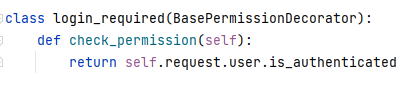

- 比如，`login_required` 类实现了用户登录的与否的判断。

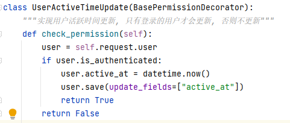

- 比如，`UserActiveTimeUpdate` 类实现了对用户请求时的活跃时间更新。

## 7.2 动态管理

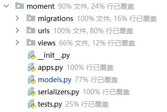

该模块负责用户对动态相关操作的实现，其中包括发布、删除、点赞动态，获取动态的相关信息等操作。用户与动态是一对多的关系，用户点赞与动态是多对多的关系。该模块中的字段**user_like**记录的是用户对动态的点赞信息，使用**ManyToMany**类型，会自动生成一个多对多的数据表，后端接收用户和动态的**id**后调用**add**或者**move**方法对**ManyToMany**类型进行操作，更新用户对动态的点赞信息。同时在Model中将一些常用的操作（如获取点赞数量等）编写为类下的函数，避免对冗余代码的重复编写。

### 7.2.1 详细内容实现

- 用户发布动态，**url** 匹配到合适的路由后转发给 **view**，**view** 接收前端传来的动态信息进行更新数据表，如果有图片信息，则前端需要分两次接口分别上传图片和动态内容，前端先上传图片，然后整合图片**url**和动态信息在发起发布动态的后端请求，让两次请求的信息在数据表中统一。

- 用户单独上传动态图片的处理，首先调用**Serializer**类进行数据的序列化处理，**view**接收到**formdata**数据类型后判断图片是否符合要求（大小，格式等），之后在后端依照当前时间创建相应的目录保存图片，并返回图片的**url**。

- 用户对动态点赞，该模块中的字段**user_like**记录的是用户对动态的点赞信息，使用**ManyToMany** 类型，会自动生成一个多对多的数据表，后端接收用户和动态的**id**后调用**add**或者**move**方法对 **ManyToMany** 类型进行操作，更新用户对动态的点赞信息。**url**匹配到合适的路由后转发给 **view**，**view** 会会通过**Serializer**类进行数据的序列化处理，然后根据用户id调用add或者move函数更新动态的点赞状态。

- 用户删除动态，**url **匹配到合适的路由后转发给 **view**，**view** 会通过**Serializer**类进行数据的序列化处理，然后根据动态**id**进行级联删除数据库里面的信息。

- 获取动态信息，**url **匹配到合适的路由后转发给 **view**，**view** 会通过**Serializer**类进行数据的序列化处理，然后根据需求将数据处理为**json**格式后**（创建list列表，sort排序等操作）**回传给前端，传输过程中调用**Serializer**类进行数据的序列化处理

- 用户搜索动态，**url**匹配到合适的路由后转发给**view**，**view**会通过**Serializer**类进行数据的序列化处理，**view**中提取前端传入的参数**keywork**，对其进行预处理（**去头尾空字符，敏感词判断，逻辑判断等）**，然后通过**Django**的**filter多字段模糊查询**，据需求将数据处理为**json**格式后**（创建list列表，sort排序等操作）**回传给前端，传输过程中调用**Serializer**类进行数据的序列化处理。

- 获得与我相关的点赞信息，这里由于 ManyToMany 字段无法记录添加字段的时间，使用辅助表 LikeMomenttTime 来进行记录点赞的时间，查询该表可以找到与用户相关的点赞记录，然后将数据处理为 **json** 格式后**（创建 list 列表，sort 排序等操作）**回传给前端，传输过程中调用 **Serializer** 类进行数据的序列化处理。

## 7.3 评论管理

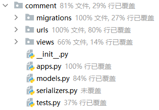

该模块负责用户对动态的评论相关操作的实现，用户与动态是一对多关系，用户与评论是一对多关系，动态与评论是一对多关系。一个动态下对应着多个评论。评论的基本Model为**BaseComment**，其中包含评论的内容，评论的用户，以及评论的点赞信息。

该**BaseComment**中的字段**user_like**记录的是用户对评论的点赞信息，使用**ManyToMany**类型，会自动生成一个多对多的数据表，后端接收用户和动态的**id**后调用**add**或者**move**方法对**ManyToMany**类型进行操作，更新用户对动态的点赞信息。同时在Model中将一些常用的操作（如获取对某条评论点赞数量等）编写为类下的函数，避免对冗余代码的重复编写。

**BaseComment**还有一个字段**parent**，为**TreeForeignKe****y**类型**，**这个是一个自关联外键，是一种树的类型，负责将数据库表作为树型结构管理的详细信息，并提供用于处理树型模型实例的工具。主要用来区别评论等级。第一级的评论它的**parent**为**null**，其他级别的**parent**为它的父节点，这样有利于构建前端的评论树结构。

该模块的数据条目的Model为MomentComment，该Model继承BaseComment，增加了字段moment(评论所属的动态)和reply_to(记录评论回复给谁)，为后续的消息提醒做铺垫

### 7.3.1 详细内容实现

- 用户对评论进行点赞，**url**匹配到合适的路由后转发给**view**，**view**会通过**Serializer**类进行数据的序列化处理，**view**接收到前端传来的信息，然后根据用户id调用**add**或者**move**函数更新动态的点赞状态。

- 用户进行评论，**url**匹配到合适的路由后转发给**view**，**view**会通过**Serializer**类进行数据的序列化处理，**view**接收到前端传来的信息（评论的内容，评论的父节点等），调用Django的**create**操作创建数据条目。

- 用户对评论进行删除，**url**匹配到合适的路由后转发给**view**，**view**会通过**Serializer**类进行数据的序列化处理，然后根据评论**id**进行级联删除数据库里面的信息。

- 获取评论信息，**url**匹配到合适的路由后转发给**view**，**view**会通过**Serializer**类进行数据的序列化处理。**view**根据需求（获取与我相关的评论，获取动态下的所有评论）对数据表进行查询，查询结果返回评论树，将数据处理为**json**格式后**（创建list列表，sort排序等操作）**回传给前端，传输过程中调用**Serializer**类进行数据的序列化处理。

- 获得与我相关的点赞信息，这里由于ManyToMany字段无法记录添加字段的时间，使用辅助表 LikeMomentCommentTime 来进行记录点赞的时间，查询该表可以找到与用户相关的点赞记录，然后将数据处理为 **json** 格式后**（创建list列表，sort排序等操作）**回传给前端，传输过程中调用**Serializer**类进行数据的序列化处理。

## 7.4 收藏管理

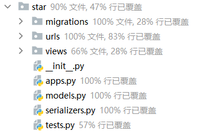

该模块负责用户收藏单的实现，用户与收藏单为一对多的关系，收藏单与动态为多对多的关系。

用户创建时，将默认拥有一张收藏单，后续可通过相应接口实现增删改查功能，实现较为简单，只需对用户进行登录判断及查询操作即可。其中将收藏单与动态的多对多关系独立为一张表，专门记录各自 `id`，借助 `Django` 方便的反向查询功能，即可解决现阶段的所有需求，如收藏或取消收藏等。

## 7.5 消息管理

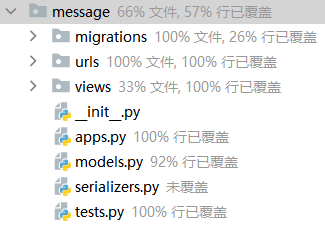

该模块负责用户的系统消息及用户间私信功能，仅完成了 `model` 层面的代码。

一方面是因为原本的期望是实现消息的推送及实时聊天，通过调研发现，简单的 `http` 通讯不能很好解决该需求，可以借助免费的基于 `socket` 实现的 `GoEasy IM` 聊天和即时通讯服务系统较好实现；另一方面，综合考虑项目进度，战略性放弃了该模块 `view` 部分的实现。

## 7.6 工具类模块

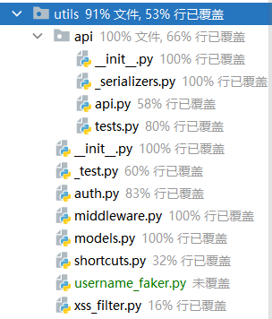

该模块负责封装了一些系统常用的方法，如通过对 `APIView` 的继承实现对系统的接口返回值格式的统一；对 `APIClient` 的继承，添加了与项目相匹配的、基于 token 登录退出的 `TestClient` ；对 `TestCase` 的继承，加入了统一的用户登录与创建等测试方法等等。

### 7.6.1 自定义用户认证中间件

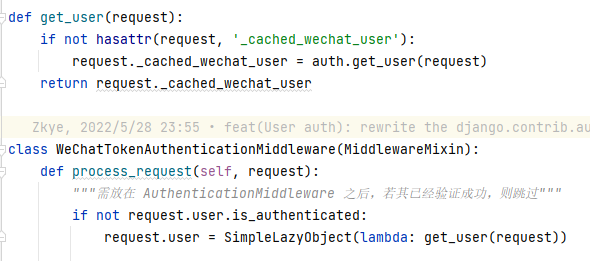

该部分的实现较为简单，由于是位于自带认证之后调用，故通过 `request.user.is_authenticated` 判断用户已认证后便跳过 `token` 认证。

若用户在此前认证失败，则 `request.user` 将会以 `AnonymousUser` 匿名用户的形式出现，该用户是无法通过我们的 `login_required` 检验的。

值得注意的是，这里的 `request.user` 使用了 `SimpleLazyObject` ，该类最大的特点就在于使用了懒加载技术，也即 `user` 的方法及数据，只用在你调用他们时才会被真正实现并加载，也就是说哪怕你实现了这一变量，但你不去调用它，实现这一变量带来的性能损耗是相当小的。

### 7.6.2 自定义用户 auth 模块部分方法

通过查看 `Django` 自带的用户认证中间件的实现我们可以发现，`request.user` 主要调用了 `auth.get_user` 方法来获得，那么我们要实现类似功能，就需要重写该方法。

这里，我主要重写了 `get_user、login、logout` 三个方法：

- `get_user`: 该方法将从 `request` 中获取 `token`，并调用`authenticates` 方法对 `token` 进行验证，若通过验证，将返回实际用户对象。通过阅读原实现，可以发现其调用了一个 `django.contrib.auth.backends.ModelBackend` 认证后端，主要是通过该后端的 `authenticates` 和 `get_user` 方法来实现用户获取。
-  `login`: 主要是判断用户是否通过认证，若通过，最后将以 `django.dispatch.Signal()` 的形式通知系统全局登录成功。
- `logout`: 主要是将用户置为匿名用户，并通过 `django.dispatch.Signal()` 的形式通知系统全局用户退出。

### 7.6.3 自定义用户认证后端

该后端继承自 `django.contrib.auth.backends.BaseBackend` ，重写了 `get_user、authenticate、user_can_authenticate` 三个方法。

- `user_can_authenticate`: 判断 user.is_active ，该字段及方法一定程度上是为了兼容 Django 自带的认证机制，当然，也实现了微信用户的禁用。
- `authenticates`: 验证用户，通过 token 获得 openid，再通过 openid 来查找用户对象，若用户存在且通过 `user_can_authenticate` 验证，则返回用户对象。
- `get_user`: 主要通过 `openid` 查找用户，若找到且通过 `user_can_authenticate` 认证则返回用户对象。

## 7.7 部署模块

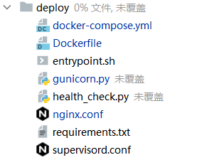

该模块负责系统的部署，包括 `docker、nginx、gunicon` 等平台的相关配置文件及 `requirements.txt` 项目依赖文件。

### 7.7.1 Docker 部署实现

`docker` 划分为了 `dove-backend、dove-redis、dove-postgres` 3大容器，后两者主要是对其官方镜像的配置，我们的重点在于前者的打包部署。

`dove-backend` 基于 `python3.8` 版本的 `docker image` 搭建，大致为三步骤：

1. 使用 `apt-get` 安装数据库等依赖，并删去不必要的缓存等。
2. 将项目文件移入镜像。
3. 根据 `requirements.txt` 安装项目依赖。
4. 执行 `migrate` 实现数据库迁移。
5. 启动 `gunicorn` 等服务。

由 `action` 完成打包及上传后，在服务端使用 `docker-compose` 进行拉取，`docker-compose.yml` 文件主要定义了：

- 项目数据库的基本信息，如数据库、用户及密码。
- 对于后端，将依赖于数据库容器，后于两者构建，定义了项目文件中所需的环境变量，并配置项目文件挂载目录便于自动化部署。

# 八、系统测试 [林悦章、叶泽楷]

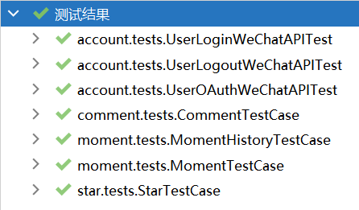

由于网络应用逻辑比较负责，且涉及到很多方面，例如：http请求路由、表单校验，应用逻辑处理，页面渲染，因此测试网页应用是非常复杂的。Django 提供了许多测试工具，这些工具可以：模拟网络请求、插入测试数据、检验应用输出、代码校验。Python 中最常用的单元测试方法是 unittest.TestCase，而 Django 中的 django.test.Testcase 是在前者的基础上进一步的封装。

Django 的设计模式是 MTV，所以主要测试的是模型跟视图，也就是数据库模型跟代码逻辑。后端共创建了 5 个 APP ，测试主要围绕该 5 大 APP 展开。

## 8.1 单元测试

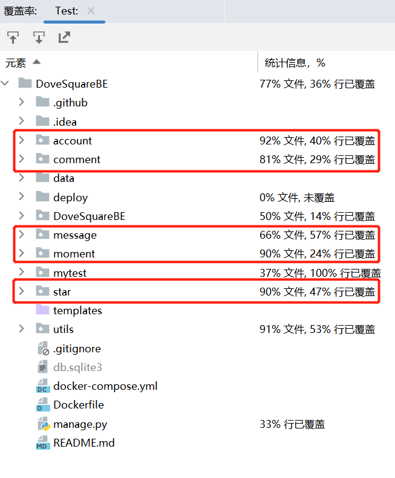

后端的单元测试对各 `model` 的增删改查做了基本的检验，同时对个别独立的 `API` 进行了测试。

### 8.1.1 下面以一个简单的评论注册表为例，说明对model字段的测试

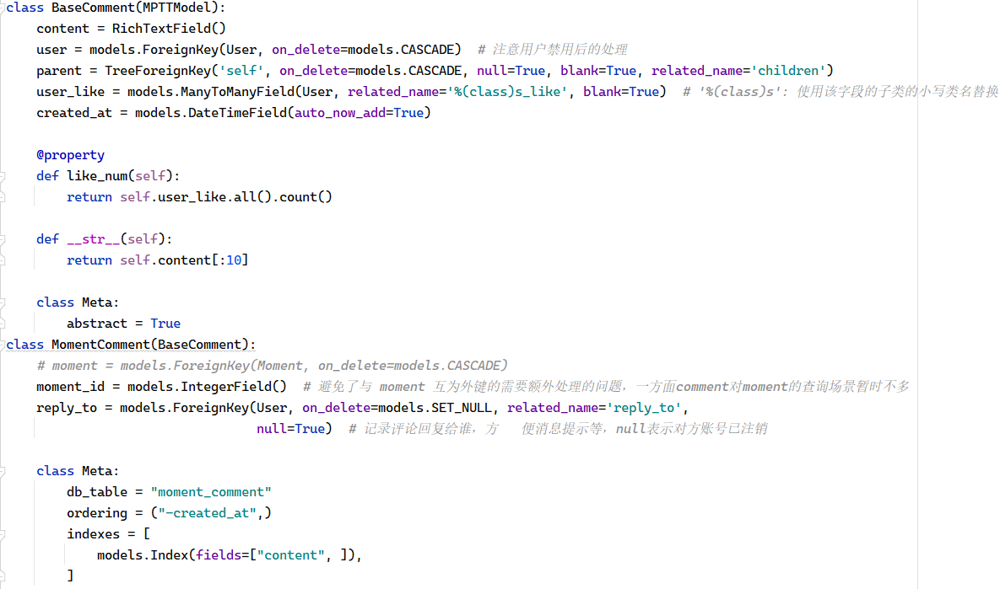

MomentComment类继承BaseComment，有moment_id，content等字段，下面对这些字段的属性进行测试。

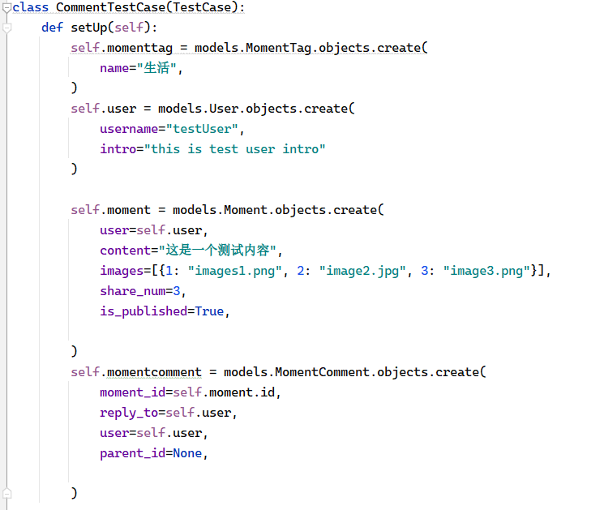

setUp函数中初始化一些测试用例数据，用这些测试用例的数据对Model数据字段进行测试


定义一个 test_comment_model 函数里面对数据模型 MomentComment 的数据表操作进行增删改查等测试。

执行命令：

```bash
python manage.py test  # 执行整个项目的单元测试
python manage.py test comment   # 只执行comment模块
python manage.py test comment.tests.XxxTestCase  # 只执行某一个测试类
```

对comment单个model的测试结果：

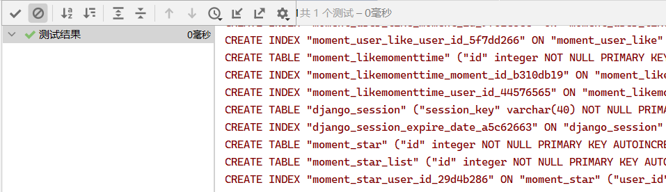

这么做的意义在于实际项目中会有几十个模型，大型项目中甚至会有上百个模型。假设某天项目负责人换了，觉得数据库中的性别字段存的都是111222不够直观，就把字段类型改成varchar，直接存“男、女”。然后把原来的数据替换更新。但是之前涉及到性别判断的模块用的都是整型，那项目运行的时候就报错了。

### 8.1.2 下面以一个简单的用户注册表为例，说明对model路由方法测试

模拟Get和Post请求，观察响应结果–从HTTP到前端内容；

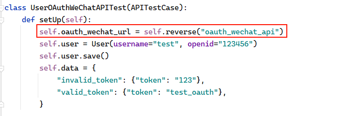

在setUp函数中定义验证微信登录路由api，以及模拟用户账号密码。

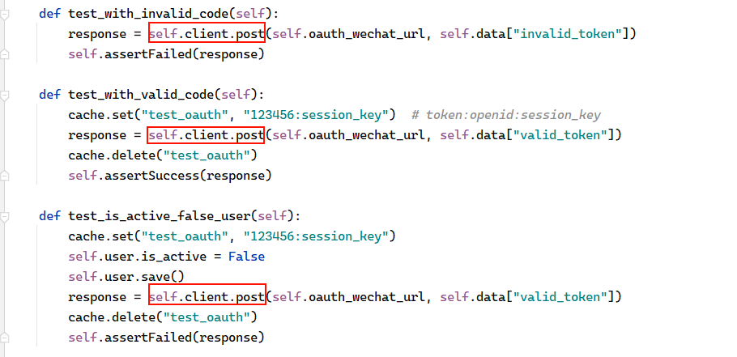

在test函数中调用client对象中post方法对后端post路由进行测试，**post(path, data=None, content_type=MULTIPART_CONTENT, follow=False, secure=False, \**extra)**，通过一个给定路径，发送一个 **POST** 请求，返回一个 **Response** 对象。采用字典的形式提交给POSTdata 参数。以上 self.client.post 方法就是使用POST数据： **username=test_oauth&password=123456** 去请求后端验证微信用户路由 **“oauth_wechat_url”**。验证数据接口的可用性以及返回数据的准确

对account单个model的测试结果：

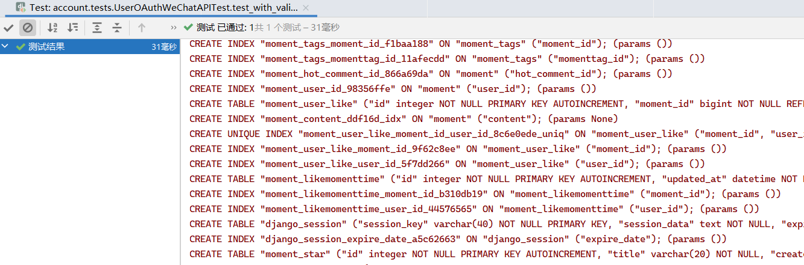


## 8.2 集成测试 [林悦章、叶泽楷]

我们使用Django集成 coverage.py ，这是一个测试Python程序的代码覆盖度的工具。首先， 安装 coverage.py 。然后， 在包含 manage.py 的项目文件夹下运行。

```bash
coverage run --source='.' manage.py test myapp
```

这样就会跑测试用例然后收集我们项目中被执行的文件的覆盖率数据。通过输入如下命令来输出这个结果的报告。

```bash
coverage report
```

此时我们可以进一步通过coverage提供的report命令来更直观的查看所执行的具体情况，此时在终端中输入：

```bash
coverage html -d html_test
```

此时就会生成一个html_test的文件夹，此时打开对应的html_test/index.html页面。此时页面如下：

查看测试报告，我们看到总的覆盖率只有50%，这是只有我们只对后端的部分接口进行路由测试，大部分接口的路由是没有测试的。但是我们对大部分Model数据类型进行测试，这是我们报告文件覆盖率高的原因。


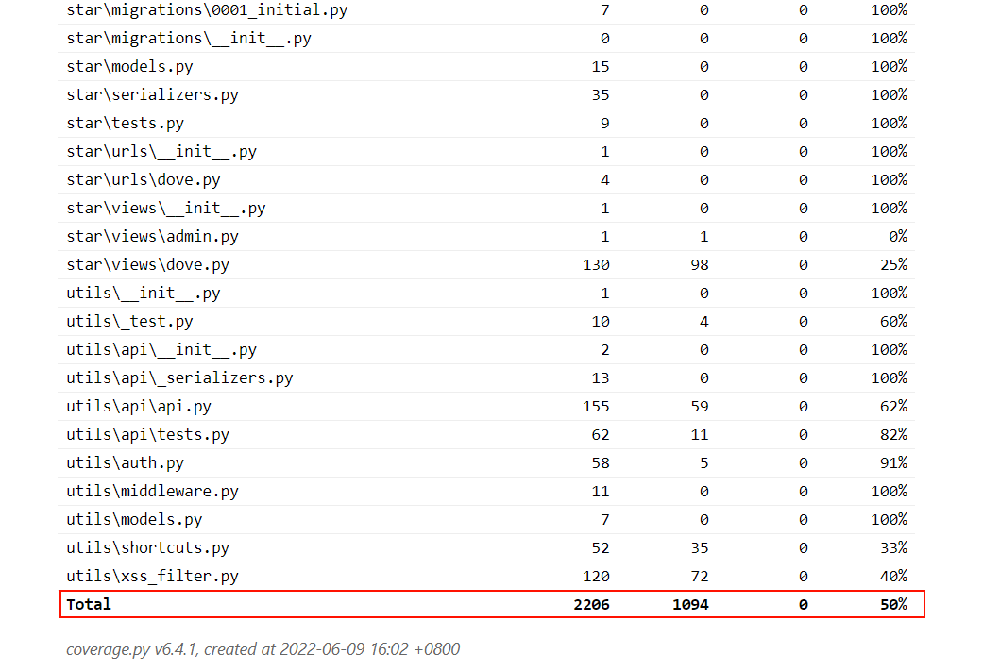

使用并发图运行Test

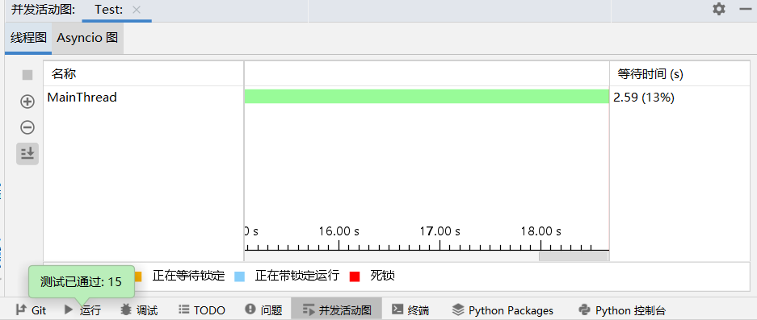

使用coverage进行对所有app进行覆盖率测试

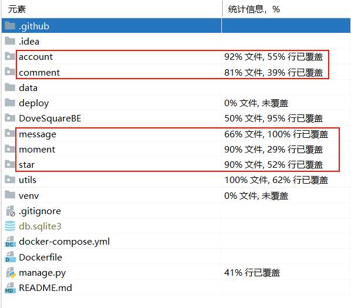

大部分文件测试覆盖率为处于一个较高的值，说明我们的测试还是比较充分的。但从报告结果中我们发现这样几个问题：

- 有一些文件其实并不需要测试，或者并非项目的核心文件（例如 django 的 migrations 文件等），这些文件应该从统计中排除。

- 虽然我们代码测试的大部分文件文件测试覆盖率为处于一个较高的值，但是对代码的行数的覆盖率却不是很高

## 8.3 测试部署及结果 [叶泽楷]

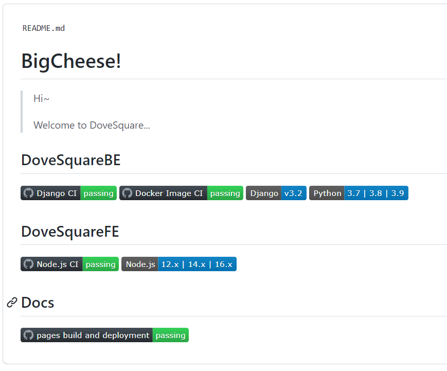

对于上述的测试，使用了 `Github Action` 进行持续集成，实现了 `Django Test` 、 `Npm Test` 、`Github Page Deploy`  3 大平台，每次 `push` 到 `github` 平台后，`action` 将自动触发，通过相应平台的测试方法，对代码自动进行测试，若测试不通过，将通过邮件第一时间通知到手机邮箱，通过检索日志，进一步定位问题。

相对于本地测试而言，在线测试更容易检测出环境依赖配置上的问题。为方便调试，后端的数据库连接设置了 2 套方案：

- `Debug = False`，线上环境，持久化数据库选用 `Postgresql` ，缓存使用了 `Redis`。
- `Debug = True`，本地环境，持久化数据库选用了 `Sqllite` ，缓存使用了 `Django` 自带的`FileBasedCache`。

另外，在线上环境，额外配置了日志输出到文件，方便排查线上运行时及本地未能调试出的 `Bug`。

以上配置均已在 `settings.py` 文件中定义完毕，借助了 `docker image` 的环境变量实现，而无需重新编写 2 套代码文件。

目前最新版本的代码均已通过了所有测试用例。

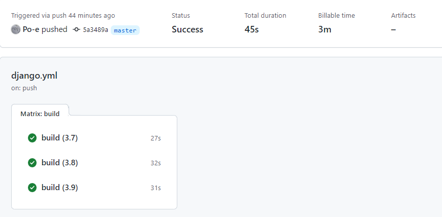

# 九、系统部署 [叶泽楷]

由于本系统使用 小程序 + Django Server 实现，因此部署的重点在于后端服务。

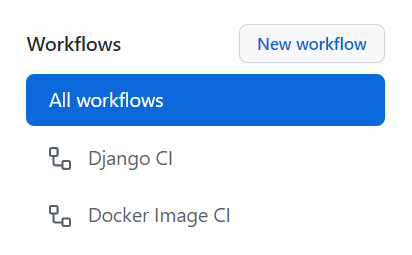

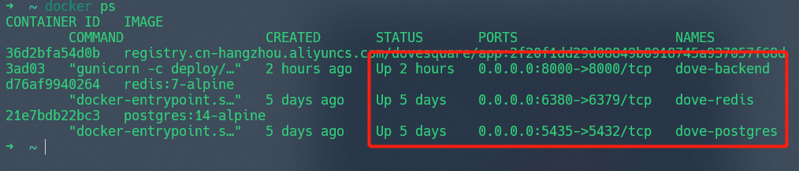

如上所示，后端使用了` Django + Gunicorn + Nginx` 进行部署，同时 3 者均已集成至 `Docker`（另外 `postgresql + redis` 均以独立 `docker` 运行），借助 `GitHub Acition` 每次只需简单地 `push` ，即可实现 `docker image` 的自动打包并发送到阿里云镜像仓库，同时将最新的代码文件部署至服务器。

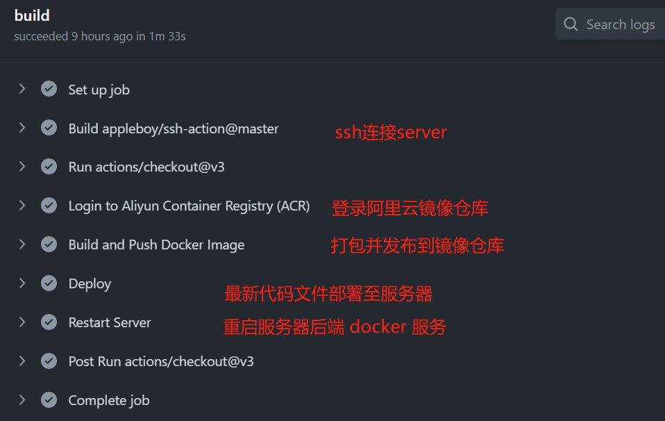

后端自动化部署流程如下：

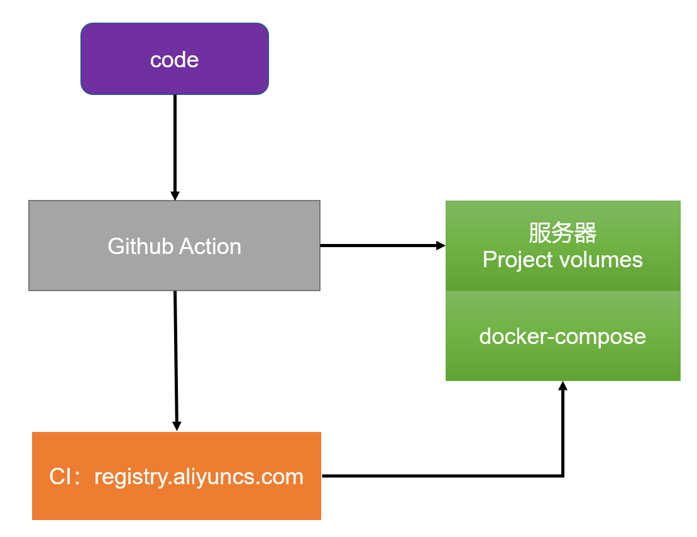

1. 根据 `Dockerfile` 文件，`action` 自动打包镜像并上传仓库。
   - 在服务器使用 `docker-compose` 进行部署，同时，为了实现代码自动更新，将项目文件挂载到本地。

2. `action` 将最新代码通过 `ssh + rsyn` 功能上传到服务器挂载指定的项目文件挂载目录，并执行 `docker restart [backend]` 实现后端代码的自动更新。

# 十、功能展示 [王俊涵]

[鸽子广场 · 小程序演示](https://github.com/bigcheeses/docs/tree/main/演示)


# 十一、清单 [叶泽楷、林悦章、王俊涵]

- 前端代码: `DoveSquareFE` 项目
- 后端代码: `DoveSquareBE` 项目
- 原型设计文件: `docs/前后端设计` 目录
- 项目API设计：`docs/API设计` 目录
- 项目演示视频: `docs/演示` 目录
- 项目在线PPT: `docs/docs` 目录
- 项目状态【CI等】: `.github/profile` 目录

# 十二、总结 [叶泽楷、林悦章、王俊涵]

通过这次移动方向实践开发，不仅让我们进一步地了解了前后端分离开发的相关流程，而且提高了我们的动手能力，让我们对前后端开发的技术掌握得更加熟练，同时也让我们了解到部分后端的单元测试与集成测试。

这次的设计过程也让我们意识到，未来的编程不是简简单单就能完成的。而编程中所出现的问题也需要不断查阅资料进行解决。开始的时候以为实现某个功能会有些难，经过对资料的查询，问题也会迎刃而解。比如，在实现前端某些复杂的功能的时候，可以通过资料的查阅，采用第三方设计来减轻页面设计的工作量，通过对其方法的重写，一样可以实现相关逻辑。更重要的是让我对系统的开发流程有一个大致的了解，从需求分析开始，一步一步的实现所需要的功能，完成系统的开发。

当然了，有时我们也会感到疲惫，不过，每多实现一个功能时获得的成就感，总是可以驱动我们坚持下去，继续努力，每做完一个系统所获得的成就感，总是可以让我们感到充实和内心的踏实。对我们来说，本项目仍存在许多不足的地方，希望在以后的学习中可以不断完善。

在未来，我们还可以实现更加美观的界面设计，更多的用户功能，比如私信、浏览历史等等；并完善权限管理，完全实现后台站点，进一步方便对平台的管理等等。

# 十二、参考文献 [叶泽楷、林悦章、王俊涵]

- **后端**

  - Django: https://docs.djangoproject.com/zh-hans/3.2/

  - python-xss-filter: http://phith0n.github.io/python-xss-filter

  - DRF: https://www.django-rest-framework.org/

- **前端**
  - uni-app: [https://uniapp.dcloud.io/ ](https://uniapp.dcloud.io/)
  - uview2.0: https://www.uviewui.com/components/intro.html
  - ThorUI: https://thorui.cn/doc/docs/introduce.html
  - hb-comment：https://ext.dcloud.net.cn/plugin?id=5625
  
- **Github Action**
  - ssh-action: https://github.com/appleboy/ssh-action
  - ssh-deploy: https://github.com/easingthemes/ssh-deploy
  - acr-login: https://github.com/aliyun/acr-login
